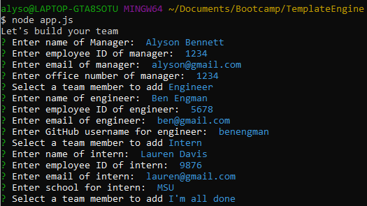
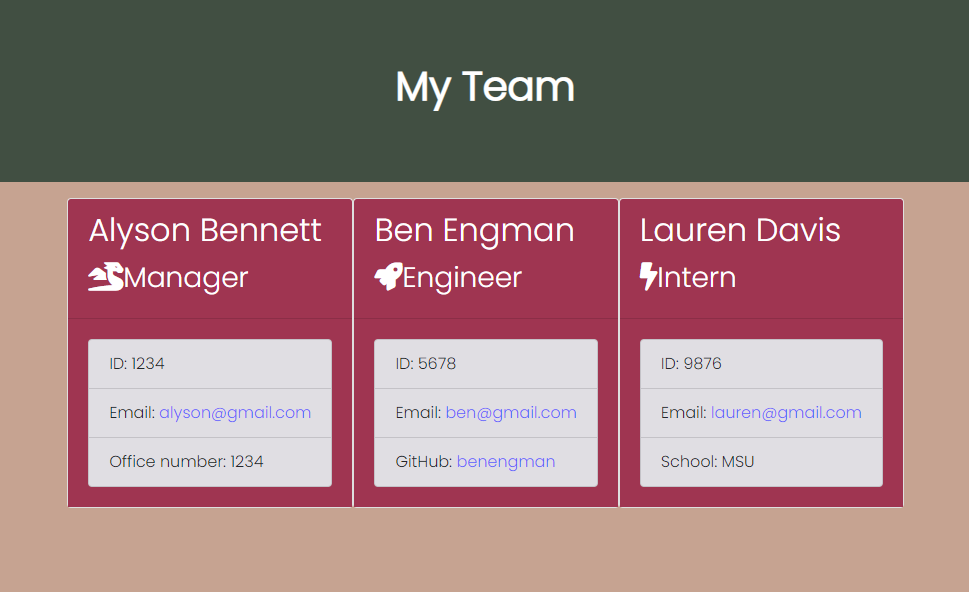

  # Engineering Team Template

  ## Description

  This application will build a software engineering team with the command line. It will prompt the user for information about the team manager and then information about the team members. The user can input any number of team members, and they may be a mix of engineers and interns. 

  ```
  As a manager
  I want to generate a webpage that displays my team's basic info
  so that I have quick access to emails and GitHub profiles
  ```

  ## Table of Contents

  * [Installation](#Installation)
  * [Usage](#Usage)
  * [License](#License)
  * [Contributors](#Contributors)
  * [Test](#Test)
  * [Questions](#Questions)

  ## Installation

  To use this application, please first do a npm install in your command line:

  ```bash
  npm install
  ```

  ## Usage

  To use this application, first fork and open the repo onto your local machine. Before attempting to use the app, open your terminal and perform a ```npm install``` to get the necessary packages. If there is not an empty "output" folder in your repo, create one now. 

  Next, type ```node app.js``` into your integrated terminal or command line. This will start the application and prompt the questions to build the software engineering team. Answer each question. To build the team, you must include one manager, and as many engineers and interns as you would like. When finished, select the "I'm all done" option.

  

  The application will automatically deploy a HTML file, which can be found in the Output folder in the repo. Open the ```team.html``` file to see the team that was built in your browser.

  

  Watch this gif to see the magic!

  


  ## Credits

  Alyson Bennett was the sole collaborator on this project. 

  ## License

  [](https://lbesson.mit-license.org/)

  [MIT](https://choosealicense.com/licenses/mit/)

  Copyright (c) 2020 Alyson Bennett

  ## Contributing

  Pull requests are welcome. For major changes, please open an issue first to discuss what you would like to change.

  [](code_of_conduct.md)

  ## Test

  This application has tests for Employee, Engineer, Intern, and Manager. Each test has passed upon deployment.

  To run these tests, perform a ```npm run test``` in your command line. 

  ## Questions

  If you have any questions, please contact [Alyson Bennett](https://github.com/alysonbennett) at alysonbennett@gmail.com.

